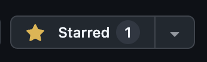

<div align="center">
  
  <h1>Hana — Your Animation Helper</h1>
  <p><strong>Frame-by-frame feedback on the 12 principles of animation.</strong></p>

  [](https://animation-error-check.onrender.com/)
  [](https://github.com/floweralicee/animation-error-check)
  [](https://www.linkedin.com/in/floweralice/)
  [](https://x.com/flower_alicee)
</div>

---

## ⭐ Support This Project

If Hana helps you, please consider giving it a star — it helps other animators find it!

The **Star** button is in the **top-right corner** of this GitHub page, next to the Fork and Watch buttons:



Thank you — it genuinely means a lot. 🙏

---

## 🌐 Try It Live

**[animation-error-check.onrender.com](https://animation-error-check.onrender.com/)**

> **Heads-up before you upload:**
> - **MP4 files only.** Convert your clip to `.mp4` first for the best results.
> - **Analysis can be slow.** The hosted site runs on a free server, so it may take a minute or two to process your clip. Please be patient!
> - **Want faster results?** Download the project and run it on your own computer — it's much quicker. See [How to Run Locally](#how-to-run-locally) below.

The site is available in **English** and **中文** — switch languages in the top-right corner.

---

## What It Does

Hana analyzes your animation clip frame by frame and gives you structured feedback based on the **12 principles of animation**.

Here's what happens when you upload a clip:

- **Reads your video** — extracts fps, duration, resolution, and frame count using bundled FFmpeg (no install required)
- **Samples up to 48 frames** evenly spaced across your clip
- **Computes motion vectors** — block-matching between consecutive frames to measure how much each part of the image is moving
- **Builds a motion profile** — tracks displacement magnitude per frame and flags possible holds (frozen frames)
- **Tracks 8 body zones** — estimates motion in the head, chest, left/right arms, core/hips, and left/right legs
- **Evaluates all 12 principles of animation:**
  - Timing · Squash & Stretch · Anticipation · Follow-Through & Overlapping Action
  - Arcs · Slow In / Slow Out · Staging · Secondary Action
  - Exaggeration · Solid Drawing · Appeal · Straight Ahead / Pose to Pose
- **Detects pixel-level issues** — low motion, overly even motion, abrupt transitions, brightness shifts, and possible holds
- **Extracts keyframe previews** — codec-level I-frames for visual reference
- **Returns an overall animation score** with per-principle scores, issue timelines, and top priorities to fix first
- **Exercise type support** — choose from Auto-detect, Bouncing Ball, Walk Cycle, Jump, or Acting to tune the analysis thresholds

---

## What It Does NOT Do (Yet)

Hana is honest about its limitations. Every result includes confidence notes explaining what was and wasn't measured.

| | Feature | Status |
|---|---|---|
| ❌ | **Natural-language AI critique** — no LLM feedback yet | Planned |
| ❌ | **Skeleton / pose tracking** — body zones are estimated from bounding boxes, not from actual joint detection (MediaPipe) | Planned |
| ❌ | **Sub-pixel optical flow** — motion uses block-matching, not Lucas-Kanade point tracking | Planned |
| ❌ | **Background removal** — MatAnyone2 integration exists in the code but is not active in production | Planned |
| ❌ | **Exercise-specific principle rules** — exercise type currently tunes thresholds only; full exercise-aware analysis is not yet implemented | Planned |

---

## How to Run Locally

Running Hana locally is **much faster** than the hosted version, and you don't need any special technical knowledge. Follow the steps below.

> **No FFmpeg installation needed.** FFmpeg is bundled inside the app — it downloads and configures itself automatically.

---

### Step 1 — Install Node.js

Node.js is the engine that runs the app. If you don't have it yet:

1. Go to **[nodejs.org](https://nodejs.org)**
2. Click the big green **"LTS"** download button (the recommended version)
3. Run the installer and follow the prompts

To check it worked, open your **Terminal** (Mac/Linux) or **Command Prompt** (Windows) and type:

```bash
node -v
```

You should see something like `v20.x.x`. Any version 18 or higher is fine.

---

### Step 2 — Install Git

Git is used to download the project files. You may already have it.

Check by running:

```bash
git --version
```

If you see a version number, you're good. If not:

- **Mac:** Install [Xcode Command Line Tools](https://developer.apple.com/xcode/resources/) or run `xcode-select --install` in Terminal
- **Windows / Linux:** Download from [git-scm.com/downloads](https://git-scm.com/downloads) and run the installer

---

### Step 3 — Download the Project

In your Terminal or Command Prompt, run:

```bash
git clone https://github.com/floweralicee/animation-error-check.git
cd animation-error-check
```

This downloads all the project files into a folder called `animation-error-check` and navigates into it.

---

### Step 4 — Install Dependencies

Still in the same terminal window, run:

```bash
npm install
```

This downloads all the libraries the app needs. It only needs to run once and takes about 1–2 minutes.

---

### Step 5 — Start the App

```bash
npm run dev
```

You'll see some output ending in something like `ready - started server on localhost:3000`. The app is now running on your computer.

---

### Step 6 — Open in Your Browser

Open your browser and go to:

**[http://localhost:3000](http://localhost:3000)**

Upload an MP4 clip and start analyzing!

To stop the app, go back to the terminal and press **Ctrl + C**.

---

### Environment Variables (Optional)

For custom settings, copy `.env.example` to `.env.local`:

```bash
cp .env.example .env.local
```

| Variable | Default | Description |
|---|---|---|
| `MAX_UPLOAD_SIZE` | `104857600` (100 MB) | Maximum upload file size in bytes |
| `SAMPLE_FRAME_COUNT` | `48` | Number of frames sampled from the video |
| `UPLOAD_DIR` | `./temp_uploads` | Temporary directory for uploaded files |

---

## Tech Stack

| Layer | Technology |
|---|---|
| Framework | [Next.js 14](https://nextjs.org) (App Router) + TypeScript |
| Styling | Tailwind CSS |
| Image processing | [Sharp](https://sharp.pixelplumbing.com) |
| Video processing | [fluent-ffmpeg](https://github.com/fluent-ffmpeg/node-fluent-ffmpeg) + bundled `ffmpeg-static` / `ffprobe-static` |
| Deployment | [Render](https://render.com) |

---

## Architecture

```
animation-error-check/
├── app/
│   ├── [locale]/page.tsx      # Bilingual upload UI (en / zh)
│   └── api/analyze/           # Analysis API endpoint
├── components/                # React UI components
├── lib/
│   ├── video/                 # FFmpeg operations (metadata, frames, keyframes)
│   ├── analysis/              # Motion vectors, body zones, 12 principles, motion profile
│   │   └── principles/        # One file per principle
│   └── output/                # JSON formatter
└── temp_uploads/              # Temporary storage (gitignored, auto-cleaned)
```

---

## Connect

Built by **Alice Chen** — animator and developer.

- 🌐 [floweralice.me](https://www.floweralice.me/)
- 💼 [linkedin.com/in/floweralice](https://www.linkedin.com/in/floweralice/)
- 🐦 [x.com/flower_alicee](https://x.com/flower_alicee)

---

<div align="center">
  <sub>MIT License · Made with care for animators everywhere</sub>
</div>
